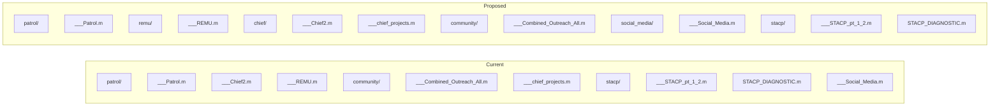

# M Code Folder Reorganization

## Current vs Proposed Structure

## File Moves

| File | From | To  |
| ---- | ---- | --- |

- `___REMU.m`: `m_code/patrol/` --> `m_code/remu/`
- `___Chief2.m`: `m_code/patrol/` --> `m_code/chief/`
- `___chief_projects.m`: `m_code/community/` --> `m_code/chief/`
- `___Social_Media.m`: `m_code/stacp/` --> `m_code/social_media/`

## Folders After Reorganization

- `m_code/patrol/` -- only `___Patrol.m`
- `m_code/remu/` -- `___REMU.m` (new folder)
- `m_code/chief/` -- `___Chief2.m` + `___chief_projects.m` (new folder)
- `m_code/community/` -- only `___Combined_Outreach_All.m`
- `m_code/social_media/` -- `___Social_Media.m` (new folder)
- `m_code/stacp/` -- `___STACP_pt_1_2.m` + `STACP_DIAGNOSTIC.m`

## Visual Export Mapping Updates

**File**: [Standards/config/powerbi_visuals/visual_export_mapping.json](Standards/config/powerbi_visuals/visual_export_mapping.json)

Changes to `target_folder` values:

- "Chief Michael Antista's Projects and Initiatives": `chief_projects` --> `chief`
- "Chief Law Enforcement Executive Duties": `law_enforcement_duties` --> `chief`
- "Social Media Posts": `social_media_and_time_report` --> `social_media`
- "Monthly Accrual and Usage Summary": stays at `social_media_and_time_report` (unchanged)
- `patrol` and `remu`: already correct, no changes needed

## Header Updates

Each moved `.m` file gets its `// # path` header comment updated to reflect the new folder location (e.g., `// # remu/___REMU.m`).

## Documentation Updates

Update [CLAUDE.md](CLAUDE.md) project map -- add `remu/`, `chief/`, `social_media/` to the m_code subfolder listing and remove the moved files from their old folder descriptions.