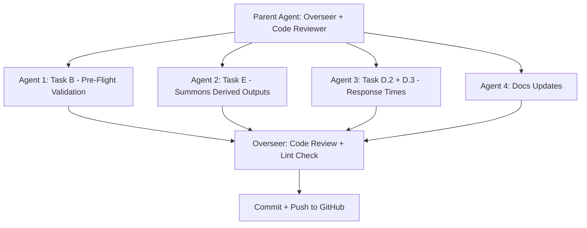

# Multi-Agent Phase 2 Remediation: Tasks B, D.2, D.3, E

## Agent Architecture

## Agent 1: Task B -- Rewrite Pre-Flight Validation

**File:** [scripts/Pre_Flight_Validation.py](scripts/Pre_Flight_Validation.py) (currently 53 lines)

**Requirements:**

- Add `argparse` with `--report-month YYYY-MM` argument; derive year/month dynamically
- Import and use `path_config.get_onedrive_root()` from [scripts/path_config.py](scripts/path_config.py)
- Update personnel file check: `Assignment_Master_V2.csv` -> `Assignment_Master_V3_FINAL.xlsx`
- E-Ticket: check `05_EXPORTS/_Summons/E_Ticket/YYYY/month/YYYY_MM_eticket_export.csv` AND `.xlsx`; treat as WARNING if missing (not FAIL)
- ATS file: treat as WARNING, not FAIL
- Visual export mapping validation: load [Standards/config/powerbi_visuals/visual_export_mapping.json](Standards/config/powerbi_visuals/visual_export_mapping.json), parse `mappings` list, assert total count >= 36, assert `enforce_13_month_window == true` count == 25
- Evidence checks: non-zero file size (100 bytes CSV, 1 KB Excel), row count for key CSVs
- Structured output: GO / NO-GO gate result with JSON summary
- Add standard artifact header (timestamp, project, filename, author: R. A. Carucci, purpose)

## Agent 2: Task E -- Summons Derived Outputs

**File:** [scripts/summons_derived_outputs_simple.py](scripts/summons_derived_outputs_simple.py) (currently 110 lines)

**Requirements:**

- Add `argparse` with `--report-month YYYY-MM`; derive month folder name dynamically (e.g., `01_january`)
- Replace hardcoded paths (lines 24-25) with `path_config.get_onedrive_root()` calls
- Dynamic output filenames: replace `nov2025` / `1125` with `YYYY_MM` from report month
- Add `IS_AGGREGATE` column (bool: True for bureau/department totals, False for individual rows) to Department-Wide output
- Rename `Sum of TICKET_COUNT` to `TICKET_COUNT` if present
- Missing input behavior: log WARNING and produce partial output (exit 0) for optional files; only hard-fail for Department-Wide
- Add standard artifact header

## Agent 3: Task D.2 + D.3 -- Response Times

**File D.2:** [scripts/response_time_fresh_calculator.py](scripts/response_time_fresh_calculator.py) (557 lines)

**Requirements for D.2:**

- Add `argparse` with `--report-month YYYY-MM` to replace hardcoded `START_YEAR`/`END_YEAR`/`START_MONTH`/`END_MONTH` (lines 67-70)
- Replace hardcoded `BASE_DIR` (line 54) with `path_config.get_onedrive_root()`
- Add explicit `df.sort_values(['ReportNumberNew', 'Time Out'], inplace=True)` before `drop_duplicates` at line 251 (ensures first-arriving unit selected)
- Add standard artifact header

**Requirements for D.3:**

- The workspace copy at [scripts/process_cad_data_13month_rolling.py](scripts/process_cad_data_13month_rolling.py) is **corrupted** -- it contains PowerShell diagnostic code instead of Python
- Replace it with a placeholder that explains the production script lives at `02_ETL_Scripts/Response_Times/process_cad_data_13month_rolling.py` and should not be edited here

## Agent 4: Docs Updates

**Files:** [CHANGELOG.md](CHANGELOG.md), [README.md](README.md), [SUMMARY.md](SUMMARY.md), [CLAUDE.md](CLAUDE.md)

**Requirements:**

- Add entries under the existing `v1.17.0` section for Tasks B, D, E completion
- Update `Pre_Flight_Validation.py` description in README directory tree
- Update SUMMARY with new validation capabilities (GO/NO-GO gate, evidence checks)
- Update CLAUDE.md project map (Pre_Flight, summons_derived, response_time scripts)
- Update Phase 2 status: Tasks B, D.2, D.3, E marked completed; Tasks A, C remaining

## Overseer Role (Parent Agent)

After all 4 agents complete:

1. Review each agent's output for correctness
2. Run `ReadLints` on all modified Python files
3. Fix any issues found
4. Commit all changes with descriptive message
5. Push to GitHub

## Acceptance Criteria

- `Pre_Flight_Validation.py` accepts `--report-month 2026-01` and prints GO/NO-GO with JSON
- `summons_derived_outputs_simple.py` accepts `--report-month 2026-01`, uses dynamic filenames, adds IS_AGGREGATE
- `response_time_fresh_calculator.py` accepts `--report-month 2026-01`, sorts before dedup, uses path_config
- `process_cad_data_13month_rolling.py` workspace copy replaced with redirect stub
- No hardcoded `C:\Users\carucci_r` paths in any modified file (all use `path_config.get_onedrive_root()`)
- All 4 docs updated with Task B/D/E completion notes
- Committed and pushed to GitHub

