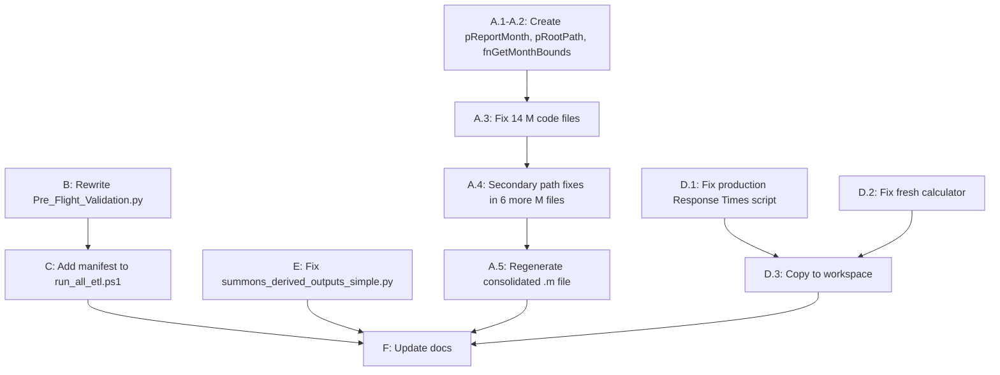

# Phase 2 Remediation Pack

## Architecture: ReportMonth Freeze Model

All rolling-window and previous-month logic in Power BI M code currently uses `DateTime.LocalNow()`, which silently shifts data windows on every refresh. The fix introduces two Power BI parameters consumed by every archive query:

- **pReportMonth** (Date) -- first day of the target month, e.g. `#date(2026, 1, 1)`
- **pRootPath** (Text) -- OneDrive root, e.g. `C:\Users\carucci_r\OneDrive - City of Hackensack`

Derived bounds computed once per query from these parameters:

```
MonthStart    = Date.StartOfMonth(pReportMonth)
MonthEnd      = Date.EndOfMonth(pReportMonth)
Rolling13Start = Date.AddMonths(MonthStart, -12)
Rolling13End   = MonthEnd
```

---

## Task A -- Power BI M Code Freeze Fix

### A.1 Create parameter queries (2 new .m files)

- `m_code/pReportMonth.m` -- Power BI parameter query returning `#date(2026, 1, 1)` as type date
- `m_code/pRootPath.m` -- Power BI parameter query returning the OneDrive root as type text

### A.2 Create shared helper function

- `m_code/fnGetMonthBounds.m` -- accepts `pReportMonth`, returns record with `MonthStart`, `MonthEnd`, `Rolling13Start`, `Rolling13End`, `PrevMonth`, `PrevYear`, `CurrYear`, `CurrMonth`

### A.3 Refactor 14 individual M code files

Each file gets three changes:

1. Add `ReportMonth = pReportMonth,` as first `let` binding (references the Power BI parameter)
2. Replace every `DateTime.LocalNow()` / `DateTimeZone.LocalNow()` / `Date.From(DateTime.LocalNow())` / `DateTime.Date(DateTime.LocalNow())` with the appropriate `ReportMonth`-derived expression
3. Replace hardcoded `C:\Users\carucci_r\...` or `C:\Users\RobertCarucci\...` or `C:\Dev\` paths with `pRootPath & "\..."` concatenation

**Files and patterns:**


| #   | File                                                                                                                                       | Occurrences         | Fix Type                   |
| --- | ------------------------------------------------------------------------------------------------------------------------------------------ | ------------------- | -------------------------- |
| 1   | `[m_code/___Overtime_Timeoff_v3.m](m_code/___Overtime_Timeoff_v3.m)`                                                                       | L28                 | Rolling window             |
| 2   | `[m_code/___Arrest_Categories_FIXED.m](m_code/___Arrest_Categories_FIXED.m)`                                                               | L44                 | Previous-month filter      |
| 3   | `[m_code/___Top_5_Arrests_FIXED.m](m_code/___Top_5_Arrests_FIXED.m)`                                                                       | L53                 | Previous-month filter      |
| 4   | `[m_code/___Top_5_Arrests_DIAGNOSTIC.m](m_code/___Top_5_Arrests_DIAGNOSTIC.m)`                                                             | L59                 | Previous-month filter      |
| 5   | `[m_code/___Cost_of_Training.m](m_code/___Cost_of_Training.m)`                                                                             | L27                 | Rolling window             |
| 6   | `[m_code/esu/ESU_13Month.m](m_code/esu/ESU_13Month.m)`                                                                                     | L76                 | Rolling window             |
| 7   | `[m_code/esu/MonthlyActivity.m](m_code/esu/MonthlyActivity.m)`                                                                             | L66                 | Rolling window             |
| 8   | `[m_code/stacp/STACP_pt_1_2_FIXED.m](m_code/stacp/STACP_pt_1_2_FIXED.m)`                                                                   | L16                 | Rolling window             |
| 9   | `[m_code/stacp/STACP_DIAGNOSTIC.m](m_code/stacp/STACP_DIAGNOSTIC.m)`                                                                       | L16                 | Rolling window             |
| 10  | `[m_code/detectives/___Detectives_2026.m](m_code/detectives/___Detectives_2026.m)`                                                         | L105, 186, 187, 195 | Rolling window + timestamp |
| 11  | `[m_code/detectives/___Det_case_dispositions_clearance_2026.m](m_code/detectives/___Det_case_dispositions_clearance_2026.m)`               | L238                | Rolling window             |
| 12  | `[m_code/___Summons_All_Bureaus_STANDALONE.m](m_code/___Summons_All_Bureaus_STANDALONE.m)`                                                 | L8                  | Previous-month calc        |
| 13  | `[m_code/___Summons_Top5_Moving_STANDALONE.m](m_code/___Summons_Top5_Moving_STANDALONE.m)`                                                 | L8                  | Previous-month calc        |
| 14  | `[Workbook_Rework/m_code/Traffic_Monthly_Rework/2026_02_20_traffic.m](Workbook_Rework/m_code/Traffic_Monthly_Rework/2026_02_20_traffic.m)` | L13                 | Rolling window             |


Excluded: `m_code/2026_02_19_jan_m_codes.m` (consolidated snapshot -- regenerate after individual files are done) and `m_code/2026_02_16_detectives.m` (superseded by `___Detectives_2026.m`).

### A.4 Secondary fixes (same pass)

- Replace hardcoded `RobertCarucci` paths in `m_code/summons/summons_13month_trend.m`, `summons_top5_parking.m`, `summons_all_bureaus.m`, `summons_top5_moving.m`
- Replace `C:\Dev\` in `m_code/___ResponseTimeCalculator.m`
- Replace hardcoded paths in `m_code/esu/ESU_13Month.m`

### A.5 Regenerate consolidated file

Rebuild `m_code/2026_02_19_jan_m_codes.m` from the corrected individual files (or document the manual assembly order).

---

## Task B -- Pre-Flight Validation Fixes

Target file: `[scripts/Pre_Flight_Validation.py](scripts/Pre_Flight_Validation.py)` (currently 53 lines, basic checks only).

### Current state (problems)

- Hardcoded to January 2026 (`2026_01_eticket_export.csv`)
- Checks `Assignment_Master_V2.csv` (should be `V3_FINAL.xlsx`)
- No E-Ticket watchdog path support
- No `visual_export_mapping.json` parsing
- No file-size or row-count evidence checks
- No distinction between FAIL (block) and WARN (continue)

### Planned changes

1. **Accept `--report-month YYYY-MM` argument** via argparse; derive year/month dynamically
2. **E-Ticket watchdog path**: check `05_EXPORTS/_Summons/E_Ticket/YYYY/month/YYYY_MM_eticket_export.csv` AND `.xlsx`
3. **ATS file**: treat as WARNING, not FAIL (log and continue)
4. **Visual export mapping validation**:
  - Load `Standards/config/powerbi_visuals/visual_export_mapping.json`
  - Parse root object, read `mappings` list
  - Assert total count stable (currently 36)
  - Assert `enforce_13_month_window == true` count equals 25
5. **Evidence checks**:
  - Non-zero file size (threshold: 100 bytes for CSV, 1 KB for Excel)
  - Row count for key CSVs (threshold: >= 1 row of data)
  - Report evidence in structured output
6. **Update personnel file check**: `Assignment_Master_V2.csv` to `Assignment_Master_V3_FINAL.xlsx`
7. **Use `path_config.get_onedrive_root()`** instead of inline fallback
8. **Structured output**: print GO / NO-GO gate result with JSON summary

---

## Task C -- Orchestrator Output Routing and Manifest

Target file: `[scripts/run_all_etl.ps1](scripts/run_all_etl.ps1)` (743 lines).

### Current state

- Lines 574-589 already copy outputs to `_DropExports` when `output_to_powerbi == true`
- No manifest written after copy
- `{REPORT_MONTH}` placeholder in `scripts.json` args field is not substituted at runtime

### Planned changes

1. **Substitute `{REPORT_MONTH}`** in script args before invocation (read from `-ReportMonth` parameter or environment variable)
2. **Manifest generation** after copy phase (lines ~590):
  - For each file copied to `_DropExports`, collect: `filename`, `size_bytes`, `modified_time`, `row_count` (CSV only, via `Import-Csv | Measure-Object`), `source_path`, `dest_path`
  - Write `_DropExports/_manifest.json` (JSON array)
  - Write `_DropExports/_manifest.csv` (flat CSV)
  - Fields: filename, size_bytes, modified_time, row_count, source_path, dest_path
3. **Drive copy rules from `output_patterns`** -- already implemented; no change needed
4. **Add `-ReportMonth` parameter** to script param block (format: `YYYY-MM`)

### Config change: `[config/scripts.json](config/scripts.json)`

- No structural changes needed; `output_patterns` and `args` fields already exist
- Verify `{REPORT_MONTH}` placeholder is present in Response Times entry (confirmed: line 199)

---

## Task D -- Response Times Stability Cleanups

### D.1 Production script (outside workspace)

Location: `02_ETL_Scripts/Response_Times/process_cad_data_13month_rolling.py`

Known bugs from chat logs:

- **Double extension**: `DEFAULT_INPUT_PATH` ends in `.xlsx.xlsx` (line ~45)
- **Wrong month**: Defaults to `2025_11_Monthly_CAD.xlsx` instead of using `--report-month` to derive input path
- **Deduplication**: Must sort by `['ReportNumberNew', 'Time Out']` before `drop_duplicates(subset=['ReportNumberNew'], keep='first')` to ensure first-arriving unit

Fixes:

1. Fix `DEFAULT_INPUT_PATH` -- remove double extension, use `timereport` naming convention (`YYYY_MM_timereport.xlsx`)
2. Derive input path from `--report-month` argument: `timereport/monthly/YYYY_MM_timereport.xlsx`
3. Add explicit `df.sort_values(['ReportNumberNew', 'Time Out'], inplace=True)` before dedup
4. Replace hardcoded `C:\Users\carucci_r\...` with `path_config.get_onedrive_root()` or argparse `--root` argument
5. Validate `--report-month` format (`YYYY-MM`)

### D.2 Fresh calculator (workspace)

Location: `[scripts/response_time_fresh_calculator.py](scripts/response_time_fresh_calculator.py)`

Fixes:

1. Add `argparse` with `--report-month YYYY-MM` (replace hardcoded `START_YEAR`/`END_YEAR`/`START_MONTH`/`END_MONTH`)
2. Sort by `['ReportNumberNew', 'Time Out']` before dedup (line 251)
3. Replace hardcoded `BASE_DIR` (line 54) with `path_config.get_onedrive_root()`

### D.3 Restore workspace copy

Copy corrected `02_ETL_Scripts/Response_Times/process_cad_data_13month_rolling.py` into `scripts/process_cad_data_13month_rolling.py` (replacing the corrupted PowerShell content).

---

## Task E -- Summons Derived Outputs Schema Alignment

Target file: `[scripts/summons_derived_outputs_simple.py](scripts/summons_derived_outputs_simple.py)`

### Current state (problems)

- Hardcoded output path to `_DropExports` (line 24) and hardcoded export path to `01_january` (line 25)
- Output filenames frozen to `nov2025` and `1125` (lines 50, 66, 82)
- No `IS_AGGREGATE` or `TICKET_COUNT` field handling
- Reads Power BI exports directly and copies them -- no derivation

### Planned changes

1. **Accept `--report-month YYYY-MM`** via argparse; derive month folder dynamically
2. **Use `path_config.get_onedrive_root()`** for all paths
3. **Dynamic output filenames**: replace hardcoded `nov2025` / `1125` with `YYYY_MM` derived from report month
4. **Schema approach**: derive fields in the derived outputs layer (option B from prompt):
  - Add `IS_AGGREGATE` column (boolean: `True` if row represents a bureau/department total, `False` for individual officer rows)
  - Ensure `TICKET_COUNT` column exists (rename from `Sum of TICKET_COUNT` if present, or compute from source)
5. **Missing input behavior**: log WARNING and produce partial output (exit 0) instead of hard FAIL (exit 1) when optional files are absent; only hard-fail when the primary Department-Wide file is missing
6. **Update `config/scripts.json`**: fix `output_patterns` to use dynamic filenames matching new naming convention

### Schema contract (to be documented)

- Required columns in Department-Wide output: `Month_Year` (MM-YY), `TYPE` (M/P), `TICKET_COUNT` (int), `IS_AGGREGATE` (bool)
- Required columns in Top 5 outputs: `Officer`, `Summons Count` (int), `Month_Year` (MM-YY)
- Required columns in All Bureaus output: `Bureau`, `M` (int), `P` (int)

---

## Task F -- Documentation Updates

### F.1 `[CHANGELOG.md](CHANGELOG.md)`

Add `[1.17.0] - 2026-02-21` entry with sections for each task (A through E), listing every file changed.

### F.2 `[README.md](README.md)`

- Document `pReportMonth` and `pRootPath` Power BI parameters
- Document manifest outputs (`_manifest.json`, `_manifest.csv`)
- Update "Enabled ETL Scripts" count and notes
- Update "Key Paths" to include E-Ticket watchdog structure

### F.3 `[SUMMARY.md](SUMMARY.md)`

- Update version to 1.17.0
- Update Phase 2 status from "In Progress" to completed items
- Add Pre-Flight GO/NO-GO gate section
- Add manifest evidence section

### F.4 `[CLAUDE.md](CLAUDE.md)`

- Add v1.17.0 Recent Updates section documenting ReportMonth freeze model
- Update "Current System Status" block
- Replace any stale references to `Assignment_Master_V2.csv` with `V3_FINAL.xlsx`
- Document new Pre-Flight validation capabilities
- Document manifest outputs

### F.5 `[docs/M_CODE_DATETIME_FIX_GUIDE.md](docs/M_CODE_DATETIME_FIX_GUIDE.md)`

- Update status column from IDENTIFIED to FIXED for all 14 files
- Add pRootPath secondary fix documentation
- Add fnGetMonthBounds helper reference

---

## Execution Order




Tasks A, B, D, and E are independent of each other and can proceed in parallel. Task C depends on understanding final output patterns from D and E. Task F runs last after all code changes are settled.

---

## Acceptance Criteria

- `rg "LocalNow" m_code/` returns zero hits across the 14 individual archive query files
- `visual_export_mapping.json` parsing in Pre_Flight reports enforced count = 25, total = 36
- All 14 archive queries produce 13 months ending at `MonthEnd` for `pReportMonth = #date(2026, 1, 1)` (window: Jan 2025 -- Jan 2026)
- `_DropExports` contains `_manifest.json` and `_manifest.csv` after orchestrator run
- Response Times script accepts `--report-month 2026-01`, loads `2026_01_timereport.xlsx`, sorts by Time Out before dedup
- No `.xlsx.xlsx` double extensions in any script
- No hardcoded `C:\Users\RobertCarucci` or `C:\Dev\` paths in any production M code or Python script

