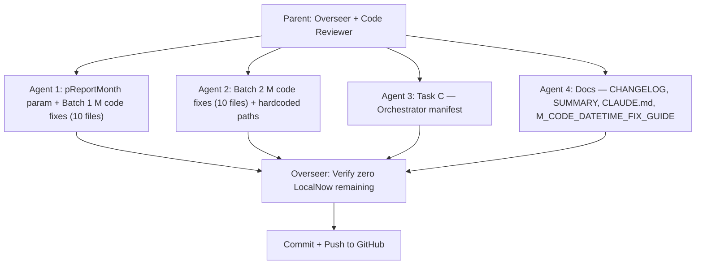

# Phase 2 Final Tasks: A (M Code ReportMonth Freeze) and C (Orchestrator Manifest)

## Scope Discovery

The explore agent found **more files than the original audit** — 20 files with 25 `DateTime.LocalNow()` occurrences (up from the documented 13), plus 9 hardcoded path instances across 7 files. The original audit missed files that were added during the reorganization or were in subfolders not previously checked.

### Full LocalNow File List (20 files, 25 occurrences)

**Rolling window pattern** (NowDT / Today / CurrentDate -> window calc):

1. `m_code/overtime/___Overtime_Timeoff_v3.m` (L28)
2. `m_code/training/___Cost_of_Training.m` (L25)
3. `m_code/esu/ESU_13Month.m` (L76)
4. `m_code/stacp/___STACP_pt_1_2.m` (L16)
5. `m_code/stacp/STACP_DIAGNOSTIC.m` (L16)
6. `m_code/stacp/___Social_Media.m` (L27)
7. `m_code/detectives/___Detectives.m` (L97, L170, L172, L180 -- 4 occurrences)
8. `m_code/detectives/___Det_case_dispositions_clearance.m` (L226)
9. `m_code/ssocc/TAS_Dispatcher_Incident.m` (L145)
10. `m_code/traffic/___Traffic.m` (L47)
11. `m_code/drone/___Drone.m` (L164)
12. `m_code/csb/___CSB_Monthly.m` (L23)
13. `m_code/shared/___DimMonth.m` (L7)
14. `m_code/summons/summons_13month_trend.m` (implicit via window calc)

**Previous-month filter pattern** (Prev / PrevDate):
15. `m_code/arrests/___Arrest_Categories.m` (L30)
16. `m_code/arrests/___Top_5_Arrests.m` (L52)
17. `m_code/summons/summons_all_bureaus.m` (L8)
18. `m_code/summons/summons_top5_moving.m` (L8)

**Filename generation pattern** (date in output name):
19. `m_code/community/___Combined_Outreach_All.m` (L26)

**Refresh timestamp pattern** (metadata, not window):
20. `m_code/detectives/___Detectives.m` (L170, L172, L180 -- already counted above)

### Hardcoded Path Files (7 files, 9 instances)

- `m_code/drone/___Drone.m` -- `RobertCarucci` (L9)
- `m_code/esu/ESU_13Month.m` -- `RobertCarucci` (L7)
- `m_code/esu/MonthlyActivity.m` -- `RobertCarucci` (L7)
- `m_code/esu/TrackedItems.m` -- `RobertCarucci` (L7)
- `m_code/response_time/___ResponseTimeCalculator.m` -- `C:\Dev` (L12, L104)
- `m_code/summons/summons_13month_trend.m` -- `RobertCarucci` (L7)
- `m_code/summons/summons_all_bureaus.m` -- `RobertCarucci` (L13)
- `m_code/summons/summons_top5_moving.m` -- `RobertCarucci` (L16)
- `m_code/summons/summons_top5_parking.m` -- `RobertCarucci` (L9)

### Existing PBIX Parameters (from `m_code/parameters/`)

- `RootExportPath` = `C:\Users\carucci_r\...\05_EXPORTS\_Benchmark` (Benchmark-specific only)
- `EtlRootPath` = `C:\Users\carucci_r\...\02_ETL_Scripts\Benchmark` (Benchmark-specific only)
- `RangeStart` / `RangeEnd` = DateTime boundaries (Benchmark date range)
- `SourceMode` = "Excel" / "Folder" toggle

These existing parameters are Benchmark-specific. We need a new **general-purpose** `pReportMonth` parameter.

---

## Agent Architecture




---

## Agent 1: pReportMonth Parameter + Batch 1 (10 files)

### Create `m_code/parameters/pReportMonth.m`

```m
// 2026-02-21-HH-MM-SS (EST)
// # parameters/pReportMonth.m
// # Author: R. A. Carucci
// # Purpose: Locked report month parameter — update this single value each monthly cycle.

#date(2026, 1, 1) meta [IsParameterQuery=true, Type="Date", IsParameterQueryRequired=true]
```

### Fix pattern for rolling window files:

Add `ReportMonth = pReportMonth,` as first line of `let` block, then replace `DateTime.LocalNow()` with `DateTime.From(ReportMonth)`.

### Fix pattern for previous-month files:

Add `ReportMonth = pReportMonth,` as first line, replace `Date.From(DateTime.LocalNow())` with `ReportMonth` or `DateTime.Date(DateTime.LocalNow())` with `ReportMonth`.

### Batch 1 files:

1. [m_code/overtime/___Overtime_Timeoff_v3.m](m_code/overtime/___Overtime_Timeoff_v3.m) (L28)
2. [m_code/training/___Cost_of_Training.m](m_code/training/___Cost_of_Training.m) (L25)
3. [m_code/esu/ESU_13Month.m](m_code/esu/ESU_13Month.m) (L76)
4. [m_code/stacp/___STACP_pt_1_2.m](m_code/stacp/___STACP_pt_1_2.m) (L16)
5. [m_code/stacp/STACP_DIAGNOSTIC.m](m_code/stacp/STACP_DIAGNOSTIC.m) (L16)
6. [m_code/stacp/___Social_Media.m](m_code/stacp/___Social_Media.m) (L27)
7. [m_code/detectives/___Detectives.m](m_code/detectives/___Detectives.m) (L97, L170, L172, L180)
8. [m_code/detectives/___Det_case_dispositions_clearance.m](m_code/detectives/___Det_case_dispositions_clearance.m) (L226)
9. [m_code/ssocc/TAS_Dispatcher_Incident.m](m_code/ssocc/TAS_Dispatcher_Incident.m) (L145)
10. [m_code/traffic/___Traffic.m](m_code/traffic/___Traffic.m) (L47)

---

## Agent 2: Batch 2 (10 files) + Hardcoded Path Fixes

### Batch 2 LocalNow files:

1. [m_code/drone/___Drone.m](m_code/drone/___Drone.m) (L164)
2. [m_code/csb/___CSB_Monthly.m](m_code/csb/___CSB_Monthly.m) (L23)
3. [m_code/shared/___DimMonth.m](m_code/shared/___DimMonth.m) (L7)
4. [m_code/arrests/___Arrest_Categories.m](m_code/arrests/___Arrest_Categories.m) (L30)
5. [m_code/arrests/___Top_5_Arrests.m](m_code/arrests/___Top_5_Arrests.m) (L52)
6. [m_code/summons/summons_all_bureaus.m](m_code/summons/summons_all_bureaus.m) (L8)
7. [m_code/summons/summons_top5_moving.m](m_code/summons/summons_top5_moving.m) (L8)
8. [m_code/summons/summons_13month_trend.m](m_code/summons/summons_13month_trend.m) (implicit)
9. [m_code/community/___Combined_Outreach_All.m](m_code/community/___Combined_Outreach_All.m) (L26)
10. [m_code/esu/MonthlyActivity.m](m_code/esu/MonthlyActivity.m) (not in LocalNow list but has hardcoded path)

### Hardcoded path fix pattern:

Replace `C:\Users\RobertCarucci\OneDrive - City of Hackensack` with `C:\Users\carucci_r\OneDrive - City of Hackensack` in all affected files. Replace `C:\Dev\PowerBI_Date` with `C:\Users\carucci_r\OneDrive - City of Hackensack\PowerBI_Date` in ResponseTimeCalculator.

Files: drone, esu (3), summons (4), response_time (1) + TrackedItems.m

---

## Agent 3: Task C — Orchestrator Manifest

Target: [scripts/run_all_etl.ps1](scripts/run_all_etl.ps1)

After the copy-to-_DropExports loop (line ~589), add manifest generation:

- Collect: filename, size_bytes, modified_time, row_count (CSV only), source_path, dest_path
- Write `_DropExports/_manifest.json` and `_DropExports/_manifest.csv`
- Add `-ReportMonth` parameter to the script's param block (format: `YYYY-MM`)

---

## Agent 4: Documentation Updates

- [CHANGELOG.md](CHANGELOG.md) — Add Task A and C completion to v1.17.0
- [SUMMARY.md](SUMMARY.md) — Update Phase 2 status to fully completed
- [CLAUDE.md](CLAUDE.md) — Update system status, add Task A/C completion notes
- [docs/M_CODE_DATETIME_FIX_GUIDE.md](docs/M_CODE_DATETIME_FIX_GUIDE.md) — Mark all files as FIXED, update file count from 13 to 20

---

## Acceptance Criteria

- `grep -r "LocalNow" m_code/ --include="*.m" | grep -v archive | grep -v all_m_code` returns zero hits
- All 20 files have `ReportMonth = pReportMonth,` as first `let` binding
- `m_code/parameters/pReportMonth.m` exists with `#date(2026, 1, 1)`
- No `RobertCarucci` or `C:\Dev` paths in any active M code file
- `run_all_etl.ps1` accepts `-ReportMonth` and writes `_manifest.json` + `_manifest.csv`
- All docs updated, committed, and pushed to GitHub

