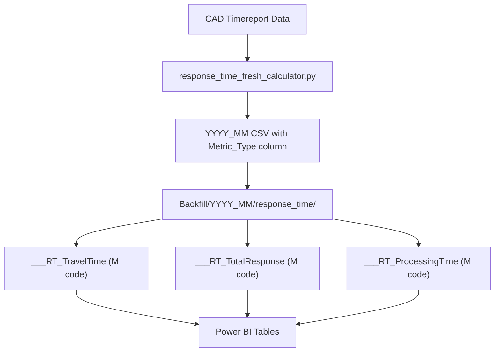

# Three Response Time Metrics for Power BI

## Current State

The ETL ([scripts/response_time_fresh_calculator.py](scripts/response_time_fresh_calculator.py)) calculates only **one metric**: `Time Out - Time Dispatched` (Travel Time). The M code ([m_code/response_time/___ResponseTimeCalculator.m](m_code/response_time/___ResponseTimeCalculator.m)) loads pre-calculated CSVs from hardcoded Backfill paths.

The CAD timereport data has all three time columns needed:

- `Time of Call` -- when the 911/call is received
- `Time Dispatched` -- when a unit is dispatched
- `Time Out` -- when the first-arriving unit arrives on scene

## Three Metrics to Implement


| #   | Metric Name | Calculation | What It Measures |
| --- | ----------- | ----------- | ---------------- |


**Metric 1 -- Travel Time**: `Time Out - Time Dispatched`. Time from dispatch to arrival on scene.

**Metric 2 -- Total Response Time**: `Time Out - Time of Call`. Total time from call received to arrival on scene.

**Metric 3 -- Processing Time (Time to Dispatch)**: `Time Dispatched - Time of Call`. Time from call received to unit dispatched.

## Architecture




## Step 1: Enhance ETL Script

**File**: [scripts/response_time_fresh_calculator.py](scripts/response_time_fresh_calculator.py)

Modify `calculate_response_times()` to compute all three metrics:

```python
df['Travel_Time_Minutes'] = (df['Time Out'] - df['Time Dispatched']).dt.total_seconds() / 60.0
df['Total_Response_Minutes'] = (df['Time Out'] - df['Time of Call']).dt.total_seconds() / 60.0
df['Processing_Time_Minutes'] = (df['Time Dispatched'] - df['Time of Call']).dt.total_seconds() / 60.0
```

Modify output format to include a `Metric_Type` column. Each month's CSV will have 9 rows (3 Response Types x 3 Metrics) instead of 3:

```csv
Response Type,MM-YY,Metric_Type,Time_MMSS
Emergency,01-26,Travel_Time,3:11
Emergency,01-26,Total_Response,4:25
Emergency,01-26,Processing_Time,1:14
Urgent,01-26,Travel_Time,2:54
...
```

**Output filename pattern**: `YYYY_MM_Response_Times_All_Metrics.csv`

Also keep backward compatibility by still outputting the original `YYYY_MM_Average_Response_Times__Values_are_in_mmss.csv` (Travel Time only) so existing M code doesn't break.

## Step 2: Create Three M Code Queries

Each query loads the same all-metrics CSV from Backfill, filters to its specific `Metric_Type`, and produces a clean table for Power BI. All three share identical structure:

- `**m_code/response_time/___RT_TravelTime.m`** -- filters `Metric_Type = "Travel_Time"`
  - Label: "Travel Time (Dispatch to Arrival)"
- `**m_code/response_time/___RT_TotalResponse.m**` -- filters `Metric_Type = "Total_Response"`
  - Label: "Total Response Time (Call to Arrival)"
- `**m_code/response_time/___RT_ProcessingTime.m**` -- filters `Metric_Type = "Processing_Time"`
  - Label: "Processing Time (Call to Dispatch)"

Each query scans the Backfill folder for all monthly CSV files matching the pattern, combines them, filters to its metric, and applies the 13-month rolling window from `pReportMonth`.

Output schema per query:

- `Response_Type` (text): Emergency, Urgent, Routine
- `MM-YY` (text): Month-year label
- `Time_MMSS` (text): Time in MM:SS format
- `Average_Time` (number): Decimal minutes for DAX measures
- `Date_Sort_Key` (date): For chronological sorting
- `YearMonth` (text): YYYY-MM for grouping

## Step 3: Run ETL to Generate January 2026 Data

Run the enhanced `response_time_fresh_calculator.py` with `--report-month 2026-01` to generate all three metrics for the 13-month window (Jan 2025 - Jan 2026).

Copy the all-metrics CSV to `Backfill/2026_01/response_time/`.

## Step 4: Keep or Retire Old Query

The existing `___ResponseTimeCalculator.m` can remain temporarily for backward compatibility. Once the admin selects their preferred metric, the old query and the two unused new queries can be disabled.

## Key Decisions

- Headers (// comments) will be included in all M code files per your preference
- PEO exclusion is not applicable to response times (CAD data, not summons)
- The 0-10 minute response time window filter stays (filters outliers)
- First-arriving unit deduplication (sort by `Time Out`, keep first per `ReportNumberNew`) is used for all three metrics
- `Time of Call` will be parsed with `pd.to_datetime(errors='coerce')` to handle nulls gracefully

